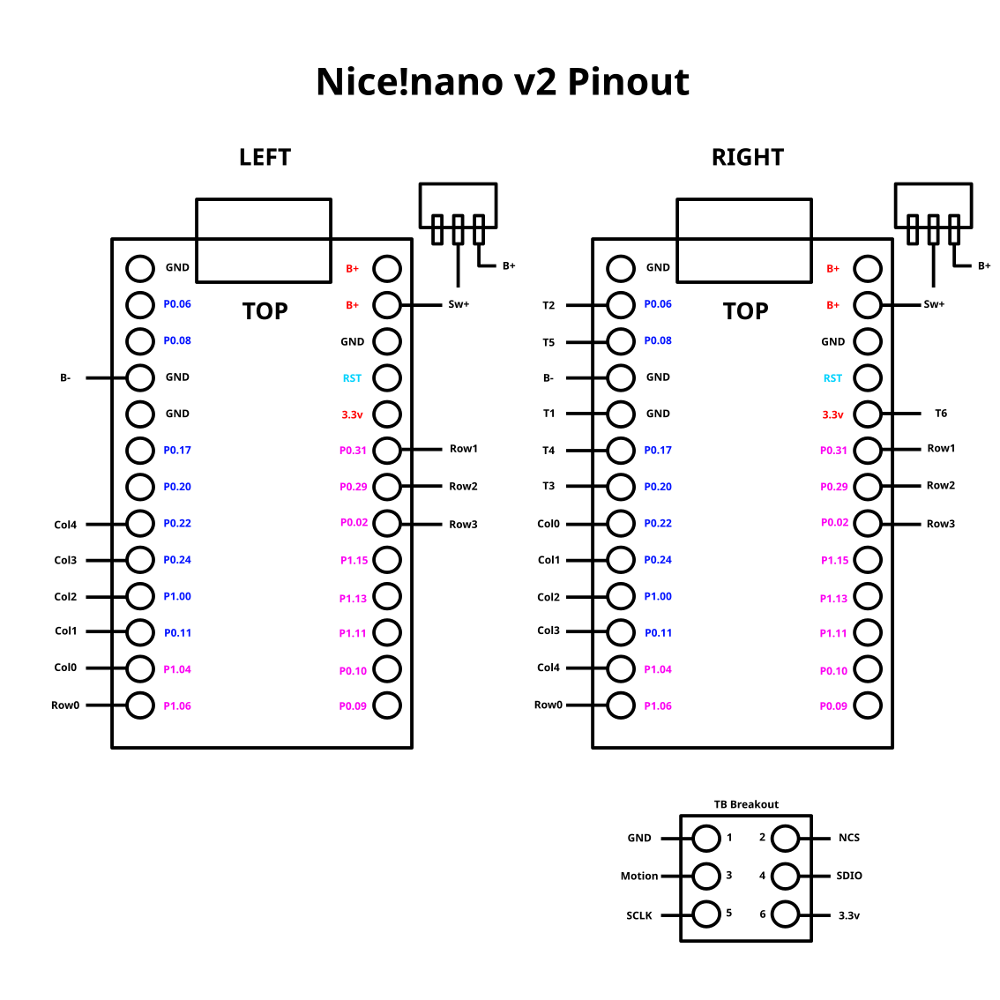

# Split36 Shield Module

## Versions

### Main
TODO: fill details

### Manuform

### Manuform Trackball
Pinout:

Keymap:
// DEFAULT
|    Q    |  W  |  F  |   P   |   B    |	.	|  J  |  L  |  U  |  Y  |  ;  |
|    A    |  R  |  S  |   T   |   G    |	.	|  M  |  N  |  E  |  I  |  O  |
|    Z    |  X  |  C  |   D   |   V    |	.	|  K  |  H  |  ,  |  .  |  /  |
		| SHF |  BSP  |  LWR   |	.	| RSE | SPC | SHF |

// LOWER (LWR)
| CTR+LFT | HOM | UP  |  END  | CTR+RT |	.	| VL- |  7  |  8  |  9  |     |
| OPT+LFT | LFT | DWN |  RT   | OPT+RT |	.	| VL+ |  4  |  5  |  6  |     |
|   ESC   |     |     | MOUSE |        |	.	| MUT |  1  |  2  |  3  | RET |
	        | BTC |       |  ---   |	.	| TOG |  0  |     |

// RAISE (RSE)
|    !    |  @  |  #  |   $   |   %    |	.	|  ^  |  &  |  *  |  (  |  )  |
|         | CTR | ALT |  GUI  |   =    |	.	|  -  | GUI | ALT | CTR |     |
|    `    |     |     |   [   |        |	.	|     |  ]  |     |  \  |  '  |
		|     |  TAB  |  TOG   |	.	| --- |     | BTC |

// GAME (GAM)
|    Q    |  W  |  F  |   P   |   B    |	.	|  J  |  L  |  U  |  Y  |  ;  |
|    A    |  R  |  S  |   T   |   G    |	.	|  M  | MB4 | MB5 |  I  |  O  |
|   SHF   |  X  |  C  |   D   |   V    |	.	| MB3 | BM1 | MB2 | SCR |  /  |
		| CTL |  ALT  |  BSP   |	.	| GAM | SPC | RET |

// TOGGLE (TOG)
|   BT0   | BT1 | BT2 |  BT3  |  BT4   |	.	| BTC |     |     |     | GAM |
|   F1    | F2  | F3  |  F4   |  F5    |	.	| F6  | F7  | F8  | F9  | F10 |
|   F11   | F12 |     |       |        |	.	|     |     |     |     |     |
		|     |       |  ---   |	.	| --- |     |     |

// MOUSE (MOUSE)
|         |     |     |       |        |	.	|     |     |     |     |     |
|         |     |     |       |        |	.	|     | MB4 | MB5 |     |     |
|         |     |     |  ---  |        |	.	| MB3 | MB1 | MB2 | SCR |     |
		|     |       |        |	.	|     |     |     |
